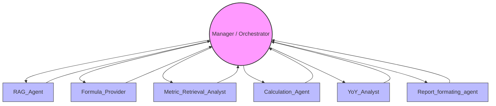

# Financial Analysis Multi-Agent System

## Introduction

This project implements a modular, multi-agent system for automated financial analysis and reporting. It leverages advanced AI agents to extract, analyze, and synthesize financial data, producing comprehensive, institution-grade financial reports. The system is orchestrated by a central Manager (Orchestrator) agent, which coordinates the workflow among six specialized agents.

## Agent Overview

- **Manager (Orchestrator):** Coordinates the entire workflow, delegates tasks, and integrates results from all specialized agents.
- **RAG_Agent:** Retrieves business sector and root causes for metric changes.
- **Formula_Provider:** Supplies relevant financial formulas and variable names.
- **Metric_Retrieval_Analyst:** Extracts variable and metric data from financial documents.
- **Calculation_Agent:** Performs mathematical calculations on provided variables and formulas.
- **YoY_Analyst:** Conducts Year-over-Year (YoY) analysis on financial metrics.
- **Report_formating_agent:** Formats and generates the final financial analysis report.

## Agent Communication Flow



## Setup & Usage

1. **Install dependencies:**
   ```bash
   pip install -r requirements.txt
   ```
2. **Configure environment variables:**
   - Set up Azure/OpenAI credentials and endpoints as required by the agents.
3. **Run the main workflow:**
   - Use the provided Jupyter notebook (`financial_analysis_workflow.ipynb`) or Python scripts to launch the orchestration.

## Notes
- Each agent is modular and can be extended or replaced as needed.
- The orchestrator ensures robust error handling and workflow recovery.

---

For more details, see the agent YAML files and the main workflow notebook. 